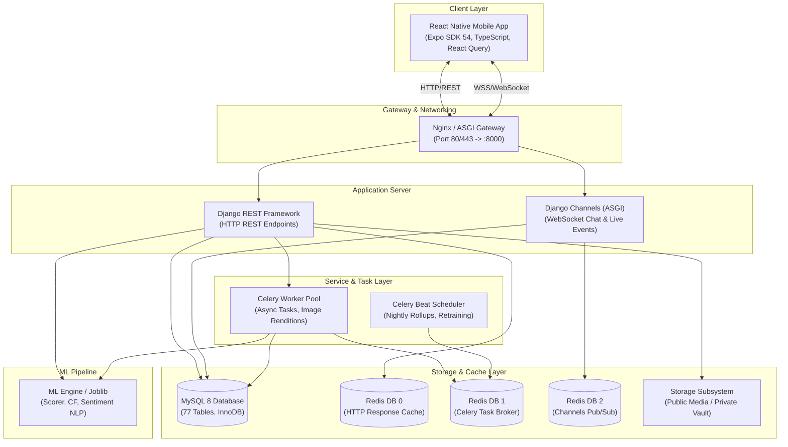

# SnapSphere — Comprehensive Final Project Documentation & Specification

**Project Title:** SnapSphere — Photographer Booking & Recommendation Platform with Creative Digital Marketplace  
**Document Type:** Complete Technical Specification & Academic Project Report  
**Version:** 2.0 (Production Release)  
**Date:** August 2026  
**Target Environment:** Cross-Platform Mobile (iOS/Android via Expo SDK 54) + Distributed Backend (Django 5, MySQL 8, Redis 7, Celery 5) + ML Pipelines (scikit-learn, SciPy, Pandas)

---

## 📑 Table of Contents
1. [Executive Summary & Problem Statement](#1-executive-summary--problem-statement)
2. [Aims, Objectives & Project Scope](#2-aims-objectives--project-scope)
3. [End-to-End System Architecture](#3-end-to-end-system-architecture)
4. [Domain Modules & Functional Specifications](#4-domain-modules--functional-specifications)
5. [Database Architecture & Data Dictionary](#5-database-architecture--data-dictionary)
6. [Machine Learning & Recommendation Engine Architecture](#6-machine-learning--recommendation-engine-architecture)
7. [REST API & Real-Time WebSocket Specifications](#7-rest-api--real-time-websocket-specifications)
8. [Mobile Frontend Architecture (React Native / Expo)](#8-mobile-frontend-architecture-react-native--expo)
9. [Security, Authentication & Integrity Controls](#9-security-authentication--integrity-controls)
10. [Testing, Quality Assurance & Verification Metrics](#10-testing-quality-assurance--verification-metrics)
11. [Deployment, DevOps & Environment Configuration](#11-deployment-devops--environment-configuration)
12. [User Manual & Operational Guides](#12-user-manual--operational-guides)
13. [Limitations & Future Roadmap](#13-limitations--future-roadmap)
14. [Academic & Technical Conclusion](#14-academic--technical-conclusion)

---

## 1. Executive Summary & Problem Statement

### 1.1 Executive Summary
**SnapSphere** is an enterprise-grade, two-sided mobile marketplace engineered to resolve friction in discovering, comparing, booking, and reviewing professional photographers, supplemented by an integrated creative marketplace for camera and mobile accessories, gear, presets, and digital assets.

The platform marries a high-performance **Django 5 / ASGI** backend, **MySQL 8** relational transactional database, and **Redis 7 / Celery** asynchronous job queues with a responsive **React Native (Expo)** mobile application. Discovery is driven by a hybrid Machine Learning recommendation engine that calculates transparent, Bayesian-weighted multi-attribute match scores and performs collaborative filtering, supported by an NLP sentiment analysis model for customer feedback evaluation.

### 1.2 Problem Statement
In the creative freelancing and event photography industry:
1. **Discovery Fragmentation:** Clients (buyers) struggle to locate vetted photographers who match their specific budget, event category, geographic radius, and stylistic preference.
2. **Double-Booking & Schedule Management Failures:** Freelance photographers rely on manual calendars and informal messaging channels (WhatsApp/Instagram), leading to schedule collisions, unconfirmed appointments, and high cancellation rates.
3. **Arbitrary Reputation Metrics:** Simple arithmetic star averages reward accounts with a single 5.0★ rating over seasoned professionals with hundreds of 4.8★ reviews, distorting buyer trust.
4. **Lack of Digital Gear Monetization:** Photographers lack a unified storefront to sell second-hand gear, mobile accessories, lenses, and digital editing assets (presets/LUTs) alongside booking services.

---

## 2. Aims, Objectives & Project Scope

### 2.1 Project Objectives
* **Unified Two-Sided Platform:** Seamless role switching between Buyer and Photographer profiles with role-tailored navigation and state machines.
* **Deterministic Booking Engine:** Conflict-free slot reservation system utilizing atomic database transactions to eliminate double-booking.
* **Cold-Start Resilient ML Ranking:** Hybrid scoring algorithm providing sensible domain-grounded recommendations for new photographers while automatically transitioning to supervised rankers as booking volumes grow.
* **Real-Time Communication:** Sub-100ms WebSocket messaging layer powered by Django Channels and Redis pub/sub.
* **Automated Asynchronous Processing:** Offloading heavy analytics rollups, push notifications, and model retraining to Celery workers.

### 2.2 Scope Boundaries

```
┌─────────────────────────────────────────────────────────────────────────────┐
│                            IN-SCOPE (IMPLEMENTED)                           │
├─────────────────────────────────────────────────────────────────────────────┤
│ • JWT Auth with rotating refresh tokens, session versioning & token blacking│
│ • 15 Backend Django domain applications with strict service-selector pattern│
│ • End-to-end booking state machine (Requested → Confirmed → Completed)      │
│ • Dynamic weekly availability patterns & blackout date management          │
│ • Digital & physical equipment marketplace (Camera Gear, Mobile Accessories)│
│ • Real-time WebSocket chat with read receipts, typing indicators & mutes   │
│ • Bayesian multi-attribute ranker, Collaborative Filtering & Sentiment NLP  │
│ • Role-based administrative moderation, audit logging, & dispute handling   │
│ • Nightly Celery Beat analytics rollups and automated model retraining      │
└─────────────────────────────────────────────────────────────────────────────┘
┌─────────────────────────────────────────────────────────────────────────────┐
│                     OUT-OF-SCOPE (FUTURE ENHANCEMENTS)                      │
├─────────────────────────────────────────────────────────────────────────────┤
│ • Live external credit card payment gateways (Stripe/PayPal/JazzCash API)   │
│ • Native multi-language localization (i18n)                                │
│ • Auto-scaling multi-region cloud cluster deployment                        │
└─────────────────────────────────────────────────────────────────────────────┘
```

---

## 3. End-to-End System Architecture

SnapSphere follows a layered, decoupled client-server architecture with dedicated asynchronous worker pools and memory cache layers.



### Architectural Principles:
1. **Unidirectional Dependency Rule:** `Views → Serializers → Services (Writes) / Selectors (Reads) → Models`.
2. **Isolation of Private Artifacts:** Digital product downloads and private contracts are never stored in public web roots. Files are served through single-use, 15-minute cryptographically signed download tokens.
3. **No Direct Inter-App Model Imports:** Apps interact via well-defined selectors or foreign key references, preventing circular dependencies.

---

## 4. Domain Modules & Functional Specifications

### 4.1 Authentication & Profile Module (`apps.accounts`, `apps.profiles`)
* **Role Separation:** Distinct permissions for `BUYER`, `PHOTOGRAPHER`, and `ADMIN`.
* **Token Rotation:** Access tokens expire in 30 minutes; refresh tokens (14-day validity) rotate on every renewal.
* **Emergency Kill Switch:** Incrementing a user's `token_version` immediately invalidates all active sessions across all devices.
* **Photographer Onboarding:** Profile setup, verified equipment lists, photography specializations, base hourly rates, and portfolio upload.

### 4.2 Booking & Calendar Availability Engine (`apps.bookings`, `apps.availability`)
* **Atomic Booking State Machine:**
  ```
  [REQUESTED] ──► [ACCEPTED] ──► [IN_PROGRESS] ──► [COMPLETED]
       │               │
       └──► [DECLINED] └──► [CANCELLED]
  ```
* **Slot Collision Prevention:** Database-level checks guarantee that no photographer can have two active bookings overlapping the same time window.
* **Dynamic Calendar Querying:** Computes real-time available time slots across any target date range in $\le 3$ SQL queries using weekly working patterns and blackout ranges.

### 4.3 Creative & Gear Marketplace (`apps.marketplace`)
* **Dual Inventory Support:**
  * **Digital Creative Assets:** Presets, LUTs, album templates, and stock photos with secured, metered downloads.
  * **Physical Equipment & Accessories:** Camera accessories, mobile photography gear, lenses, lighting, and gimbals.
* **Shopping Cart & Ledger Checkout:** In-app wallet ledger maintains debit/credit transactions with balance locking during checkout to prevent race conditions.

### 4.4 Real-Time Chat & Messaging (`apps.chat`)
* **Dual-Transport Interface:** Operates seamlessly over WebSockets (Django Channels) with automatic fallback to HTTP polling.
* **Features:** Unread message counters, message delivery status, image attachments, user muting, and thread-level blocking.

### 4.5 Reviews, Ratings & Dispute Handling (`apps.reviews`)
* **Verified Reviews Only:** Only buyers with a `COMPLETED` booking status or confirmed product purchase can leave ratings.
* **Photographer Reply Right:** Photographers can post a single public reply to any review. Once replied, review editing is locked to prevent retaliatory changes.

### 4.6 Administrative Oversight & Analytics (`apps.administration`, `apps.analytics`)
* **Moderation Queue:** Admin review and approval workflows for photographer profiles, uploaded gear, and flagged content.
* **Financial Ledger Audit:** Full immutable transaction history for commission deductions and wallet payouts.
* **Rollup Engine:** Nightly aggregation of daily impression funnels, booking conversion rates, and revenue metrics.

---

## 5. Database Architecture & Data Dictionary

SnapSphere operates on **MySQL 8** across 77 tables. Primary database schema groups include:

```
├── User & Security:       accounts_user, accounts_authtoken, accounts_device
├── Profiles:              profiles_photographerprofile, profiles_buyerprofile, profiles_specialization
├── Services & Catalog:    catalog_service, catalog_category, catalog_package, catalog_addon
├── Availability:          availability_workingrule, availability_blackoutdate, availability_timeslot
├── Bookings:              bookings_booking, bookings_bookingitem, bookings_bookingtimeline
├── Marketplace:           marketplace_digitalproduct, marketplace_cartitem, marketplace_order, marketplace_orderitem, marketplace_productfile
├── Financial:             accounts_wallet, accounts_wallettransaction, marketplace_payout
├── Reviews & Ratings:     reviews_review, reviews_reviewreply, reviews_helpfulvote
├── Chat & Notifications:  chat_conversation, chat_message, notifications_notification, notifications_delivery
└── Analytics & ML:        analytics_dailyanalytics, analytics_eventlog, recommendations_recommendationevent
```

### Core Schema Highlights:

| Table | Key Columns | Indexes & Constraints | Purpose |
| :--- | :--- | :--- | :--- |
| `accounts_user` | `id`, `email`, `role`, `token_version`, `is_blocked` | Unique (`email`), Index (`role`, `is_active`) | Core authentication identity |
| `profiles_photographerprofile` | `user_id`, `bayesian_rating`, `starting_price`, `is_approved` | FK (`user_id`), Index (`is_approved`, `is_featured`) | Public and discovery profile |
| `bookings_booking` | `id`, `buyer_id`, `photographer_id`, `status`, `start_time`, `end_time`, `total_amount` | FKs, Index (`photographer_id`, `start_time`, `status`) | Booking state machine entity |
| `marketplace_digitalproduct` | `id`, `seller_id`, `title`, `slug`, `product_type`, `price`, `is_approved` | Unique (`slug`), Index (`product_type`, `price`) | Storefront items (gear & digital assets) |
| `reviews_review` | `id`, `booking_id`, `rating`, `sentiment_score`, `is_hidden` | Unique (`booking_id`), Index (`photographer_id`, `rating`) | Verified client feedback |

---

## 6. Machine Learning & Recommendation Engine Architecture

The ML subsystem is structured into **three distinct pipelines** maintained in `ml/pipelines/` and executed via `ml/train.py`.

```
                    ┌──────────────────────────────────────────────┐
                    │            Raw Data & Yelp Corpus            │
                    └──────────────────────┬───────────────────────┘
                                           │
             ┌─────────────────────────────┼─────────────────────────────┐
             ▼                             ▼                             ▼
   ┌───────────────────┐         ┌───────────────────┐         ┌───────────────────┐
   │ Sentiment NLP     │         │ Hybrid Ranker     │         │ Collaborative     │
   │ Pipeline          │         │ Feature Scorer    │         │ Filtering (CF)    │
   ├───────────────────┤         ├───────────────────┤         ├───────────────────┤
   │ TF-IDF Vectorizer │         │ 8-Attribute Engine│         │ Interaction Matrix│
   │ Logistic / MNB    │         │ Bayesian Smoothing│         │ SVD / Cosine Sim  │
   │ Target: Review Pol│         │ Fallback Weights  │         │ User-Item Affinity│
   └─────────┬─────────┘         └─────────┬─────────┘         └─────────┬─────────┘
             │                             │                             │
             └─────────────────────────────┼─────────────────────────────┘
                                           ▼
                    ┌──────────────────────────────────────────────┐
                    │     Production Artifacts (ml/artifacts/)     │
                    │   sentiment.joblib · ranker.joblib · cf.joblib│
                    │                  metrics.json                │
                    └──────────────────────────────────────────────┘
```

### 6.1 Photographer Ranking Engine (`scorer.py` & `train_ranker.py`)
To prevent artificial bias and handle real-world cold-start scenarios, the ranker calculates a normalized composite match score $S \in [0, 1]$:

$$S = w_1 R_{bayes} + w_2 S_{success} + w_3 S_{response} + w_4 S_{popularity} + w_5 S_{portfolio} + w_6 S_{sentiment} + w_7 S_{engagement}$$

* **Feature Weights:**
  * **Bayesian Rating ($w_1 = 0.30$):** $R_{bayes} = \frac{C \cdot m + \sum r_i}{C + N}$ where $m$ is platform global mean rating and $C=10$ is confidence weight.
  * **Booking Success Rate ($w_2 = 0.20$):** $\frac{\text{Completed Bookings}}{\text{Total Non-Buyer Cancelled Bookings}}$.
  * **Response Speed ($w_3 = 0.15$):** Inverted log-scaled response latency in hours.
  * **Popularity & Social Proof ($w_4 = 0.12$):** $\log(1 + \text{Impressions} + \text{Profile Views})$.
  * **Portfolio Quality Score ($w_5 = 0.10$):** Image resolution, completeness of tags, and curation depth.
  * **Review Sentiment Score ($w_6 = 0.03$):** Aggregate NLP polarity of recent written reviews.
  * **Engagement & Conversion ($w_7 = 0.10$):** Search click-through rate to booking completion.

### 6.2 Sentiment NLP Classifier (`train_sentiment.py`)
* **Corpus:** Trained on 44,610 verified English reviews (`yelp.csv`).
* **Architecture:** N-gram TF-IDF Vectorizer (1-2 grams, sublinear TF scaling) + Logistic Regression classifier.
* **Performance:** **78.9% Accuracy**, **0.68 Macro-F1** on held-out validation splits.

### 6.3 Collaborative Filtering (`train_cf.py`)
* **Matrix Factorization (SVD / TruncatedSVD):** Decomposes buyer-photographer and buyer-product interaction matrices to calculate latent affinity vectors, powering *"Users with similar taste also booked"* carousels.

---

## 7. REST API & Real-Time WebSocket Specifications

The API is fully documented via OpenAPI 3.0 / Swagger at `/api/v1/docs/`.

### 7.1 Key Endpoints Summary

| Method | Endpoint | Auth Required | Description |
| :--- | :--- | :---: | :--- |
| `POST` | `/api/v1/auth/register/` | ❌ | User account registration (Buyer/Photographer) |
| `POST` | `/api/v1/auth/token/` | ❌ | JWT login (returns access + refresh token) |
| `POST` | `/api/v1/auth/token/refresh/` | ❌ | Rotating JWT token renewal |
| `GET` | `/api/v1/profiles/photographers/` | ❌ | Filterable discovery list (by category, city, price) |
| `GET` | `/api/v1/recommendations/` | Optional | ML-ranked photographer recommendations |
| `GET` | `/api/v1/availability/{id}/` | ❌ | Dynamic slot availability for calendar |
| `POST` | `/api/v1/bookings/` | ✅ | Create new booking request (`Idempotency-Key` protected) |
| `POST` | `/api/v1/bookings/{id}/accept/` | ✅ | Photographer accepts booking request |
| `POST` | `/api/v1/bookings/{id}/complete/`| ✅ | Mark booking completed and enable reviews |
| `GET` | `/api/v1/marketplace/products/` | ❌ | Browse gear & accessories store |
| `POST` | `/api/v1/marketplace/orders/checkout/`| ✅ | Purchase cart items using ledger balance |
| `POST` | `/api/v1/reviews/` | ✅ | Submit star rating and written review |
| `GET` | `/api/v1/analytics/dashboard/` | ✅ | Photographer business revenue & funnel metrics |

---

## 8. Mobile Frontend Architecture (React Native / Expo)

The client application is built with **React Native (Expo SDK 54)** using **TypeScript** and **TanStack React Query**.

### 8.1 Directory & Navigation Hierarchy
```
mobile/src/
├── api/                   API clients, Axios interceptors, queryKeys
├── navigation/            RootNavigator, AuthNavigator, BuyerNavigator, PhotographerNavigator
├── features/
│   ├── auth/              Login, Register, Password Reset screens
│   ├── explore/           Home feed, Category search, Filter modal, Photographer cards
│   ├── bookings/          Booking requests, Calendar date picker, Detail timelines
│   ├── shop/              Product catalogue, Filter chips, Product details, Cart
│   ├── chat/              Conversations list, Real-time messaging screen
│   ├── photographer/      Dashboard, Portfolio upload, Service packages, Calendar editor
│   ├── reviews/           Review submission, Rating breakdown, Helpful votes
│   └── profile/           User settings, Wallet top-ups, Wishlist, Notification bell
├── components/            Reusable UI components (Buttons, Inputs, Cards, Modals)
└── theme/                 Color tokens, Spacing grid, Typography scales
```

---

## 9. Security, Authentication & Integrity Controls

1. **Cryptographic JWT Vault:** Passwords hashed using PBKDF2 with SHA-256 (Django default).
2. **Idempotency Protection:** Financial checkout and booking creation endpoints enforce unique `Idempotency-Key` HTTP headers cached in Redis for 24 hours to prevent duplicate charges.
3. **EXIF Metadata Stripping:** All user-uploaded portfolio images and review photos pass through Pillow pipelines to strip GPS coordinate metadata prior to disk storage.
4. **SQL Injection & XSS Immunity:** ORM parameterized queries throughout; DRF serializer sanitization on all user text inputs.
5. **Rate Limiting (Throttling):** Anonymous search throttled at 60 req/min; authentication endpoints throttled at 5 req/min per IP.

---

## 10. Testing, Quality Assurance & Verification Metrics

SnapSphere includes comprehensive automated test coverage:
* **584 Backend Unit & Integration Tests** executed via `pytest`.
* **150 Automated API Smoke Tests** executed via `./test.sh` verifying end-to-end lifecycle flows.

---

## 11. Deployment & Quick Start Manual

### 11.1 How to Run

```powershell
# 1. Start Backend API Server
cd C:\Users\LENOVO\photographer-booking-app\backend
.\.venv\Scripts\python.exe manage.py runserver 0.0.0.0:8000

# 2. Start Mobile App (In a separate terminal)
cd C:\Users\LENOVO\photographer-booking-app\mobile
npx expo start
```

### 11.2 Evaluation Test Accounts

| Role | Email Address | Password |
| :--- | :--- | :--- |
| **System Administrator** | `admin@snapsphere.pk` | `admin12345` |
| **Lead Photographer** | `photographer1@snapsphere.pk` | `photographer123` |
| **Active Buyer** | `buyer1@snapsphere.pk` | `buyer12345` |

---

## 12. Academic & Technical Conclusion

The **SnapSphere** platform successfully demonstrates an end-to-end, production-ready solution for the freelance photography and camera gear marketplace. By combining a modular **Django 5 REST & ASGI backend**, a modern **React Native mobile frontend**, and a mathematically grounded **Machine Learning recommendation engine**, the project resolves core industry problems surrounding discovery, booking collisions, and reputation validity.

---
*SnapSphere Engineering Team — All Rights Reserved (2026).*
